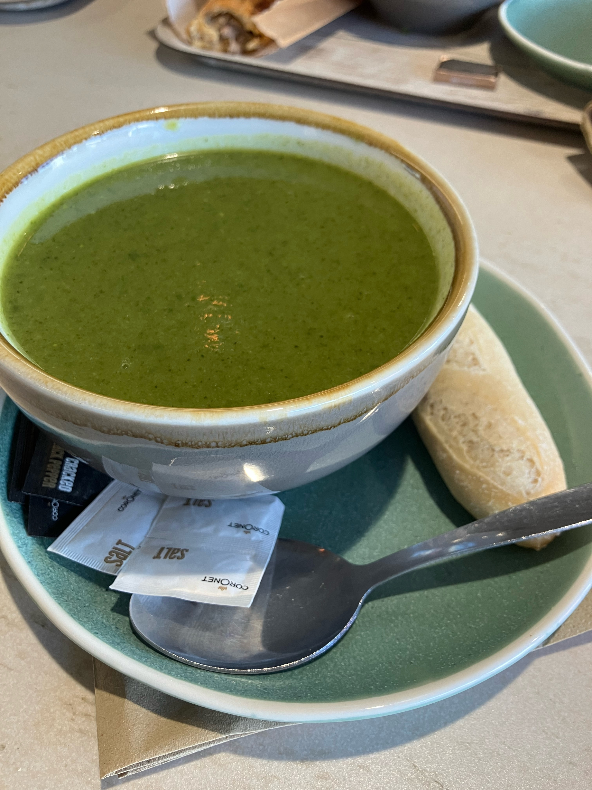
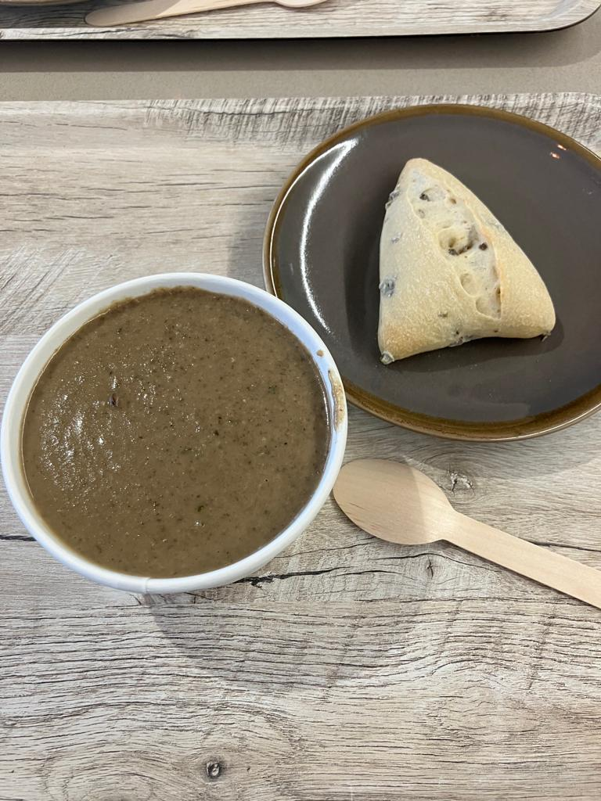
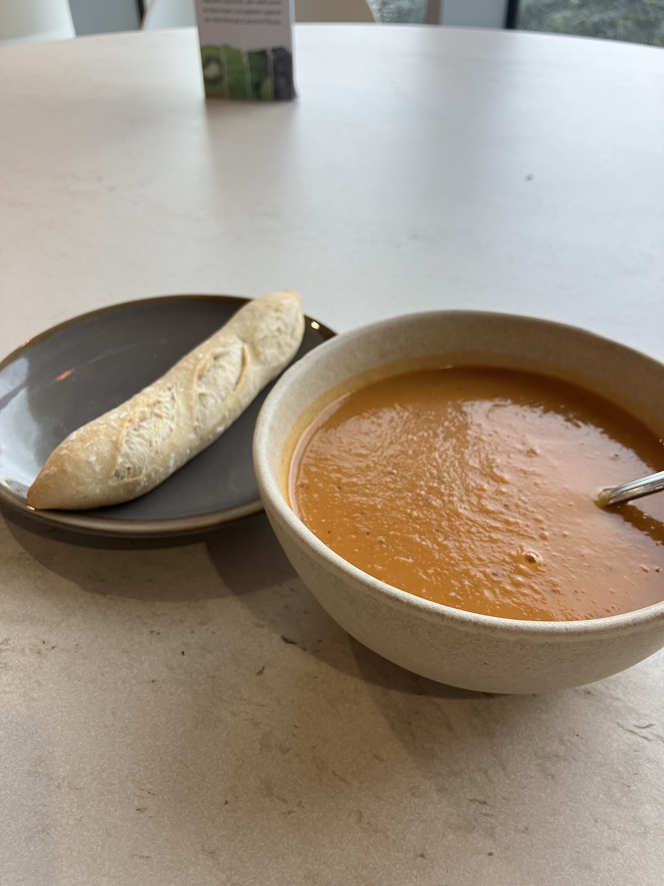
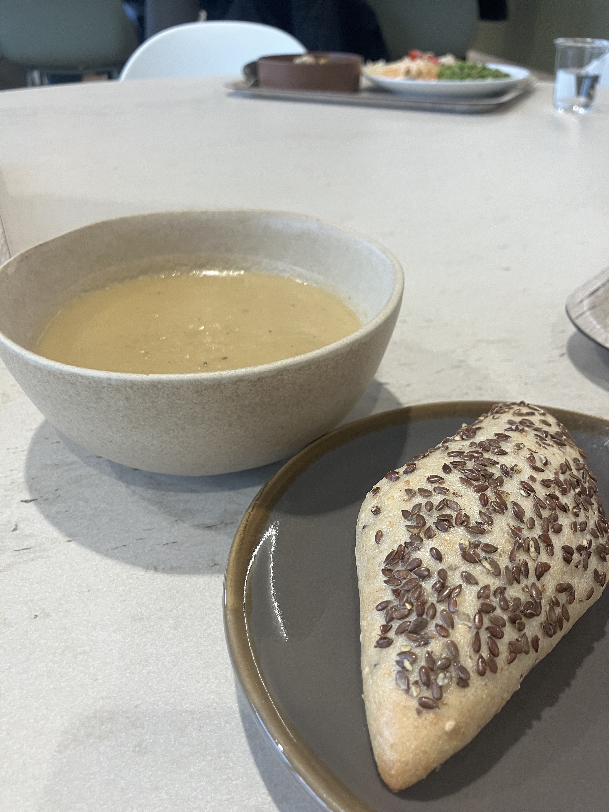

## 2024-01-16 (West Hub)

{width=80%}

Kind: _Broccoli_

Roll: _Mini Baguette_

Description: _A bit bland, not enough spoons_

Rating: **5/10**

## 2023-11-16 (West Hub)

{width=80%}

Kind: _Mushroom and cracked black pepper_

Roll: _Fun Triangular Bread_

Description: _Over reliant on its peppery taste, the first two seconds are great but the aftertaste lacks depth_

Rating: **8/10**

## 2023-11-01 (West Hub)

{width=80%}

Kind: _Curried Pumpkin_

Roll: _Petite Baguette_

Description: _Back to back curried soups, however this one was more tangy (likened to <a href="https://en.wikipedia.org/wiki/Tom_yum">Tom Yum</a>) and perfect for Autumn. Really great and full of flavour!_

Rating: **8/10**

## 2023-10-31 (West Hub)

{width=80%}

Kind: _Curried Parsnip_

Roll(s): _Poppy Seed and Linseed_

Description: _Full bodied and a hint of spice. For some the spice was "too much to eat quickly". That same person preferred the Broccoli soup, though their opinion was in the minority._

Rating: 7/10

## 2023-10-25 (West Hub)

{width=80%}

Kind: _Broccoli and Thai Green Curry_

Roll(s): _Poppy Seed_

Description: _Initially, very broccoli-forward based on just the smell. This flipped to being very thai-green-curry-forward (lemongrass, thai basil, garlic etc.) after tasting._

Rating: 6/10

